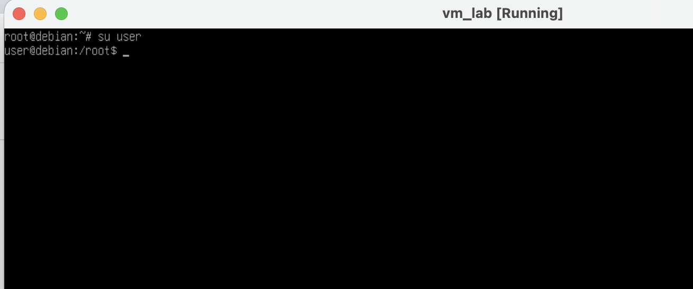
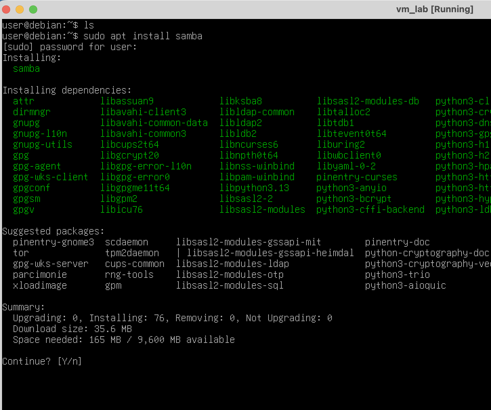

#   Практическая работа № 14

##  Установка файлового сервера Samba


<p>
Samba — пакет программ, которые позволяют обращаться к сетевым дискам и принтерам на различных операционных системах по протоколу SMB/CIFS. Имеет клиентскую и серверную части. Является свободным программным обеспечением, выпущена под лицензией GPL.
</p>


### Задание

Ход работы сопровождайте скриншотами.

1. Используя предоставленный образ ОС, развернуть виртуальную машину. 



2. Установить пакет samba




3. Создать папку /opt/share - общая сетевая папка

4. Отредактировать конфиг samba:

```
    sudo nano /etc/samba/smb.conf
```

добавив в него следующие строчки: 


```
[share]
path = /opt/share
read only = no
guest ok = no
valid users = user
```

5. Выполнить команду

```
sudo smbpasswd -a user
```

6. Перезапустить службу samba

```
sudo systemctl restart smbd.service
```

7. Изменить тип сетевого подключения VM на Bridged

8. Определить IP vm и подключиться к сетевой папке. 

```
\\ip_address\share
```

9. Сохранить в сетевую папку текстовый файл, в котором запишине ваше полное имя и группу

10. На стороне хоста прочитайте этот файл.

* В случае возникновения сложностей при сохранении файла, проверьте права доступа к сетевой папке.