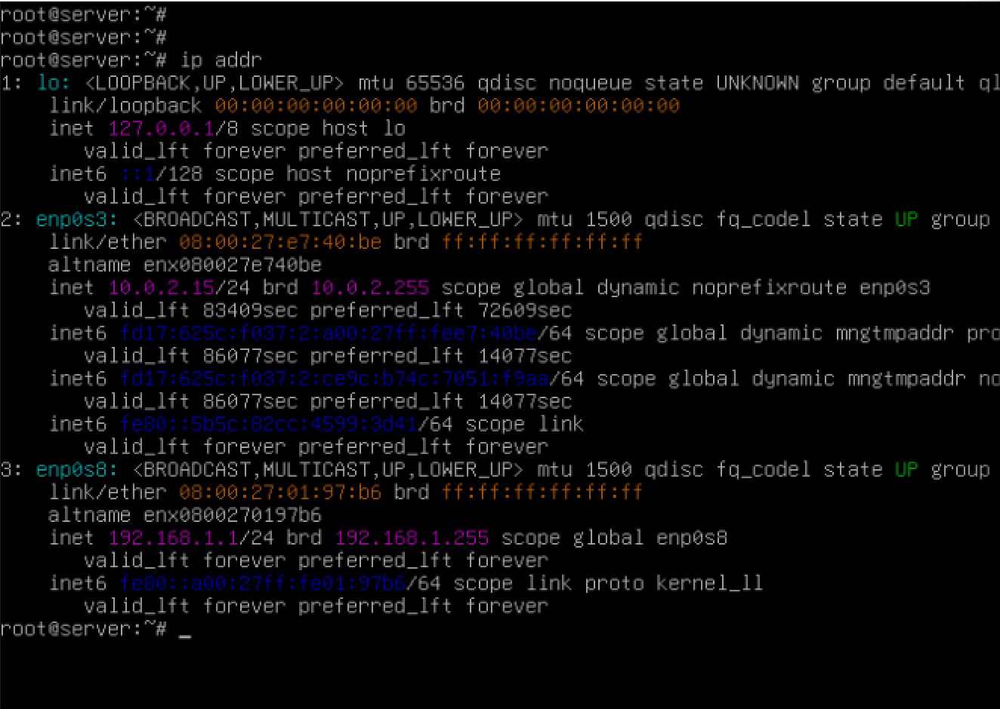
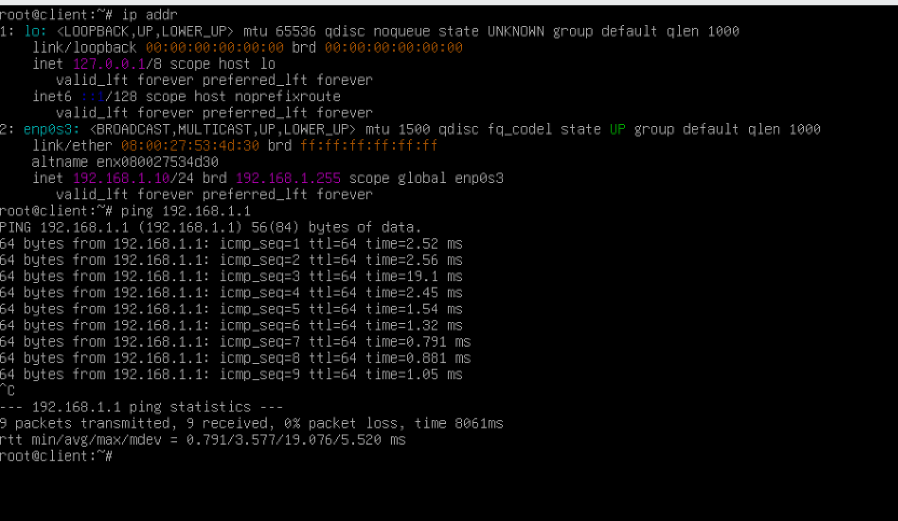
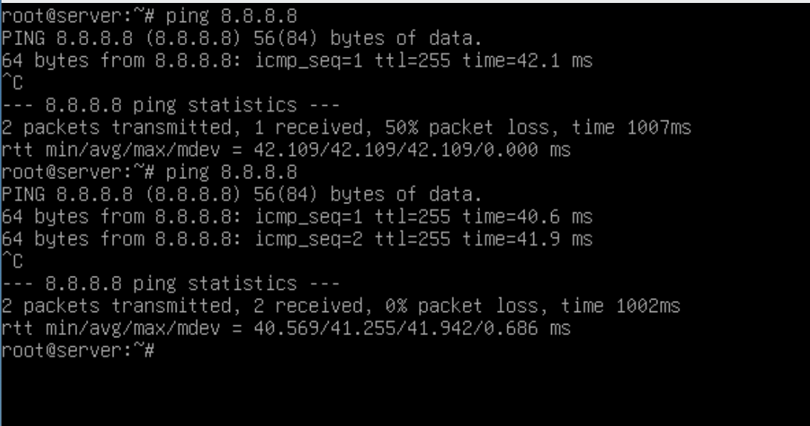
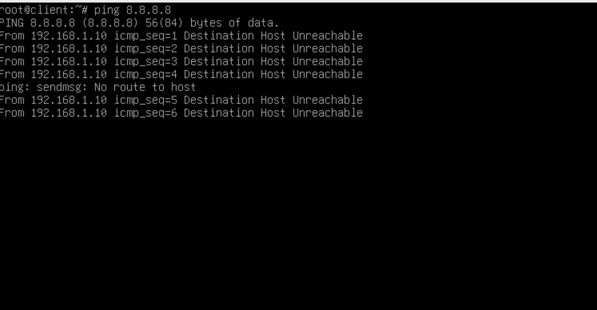
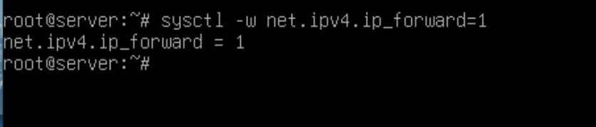
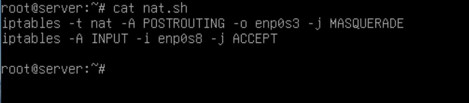
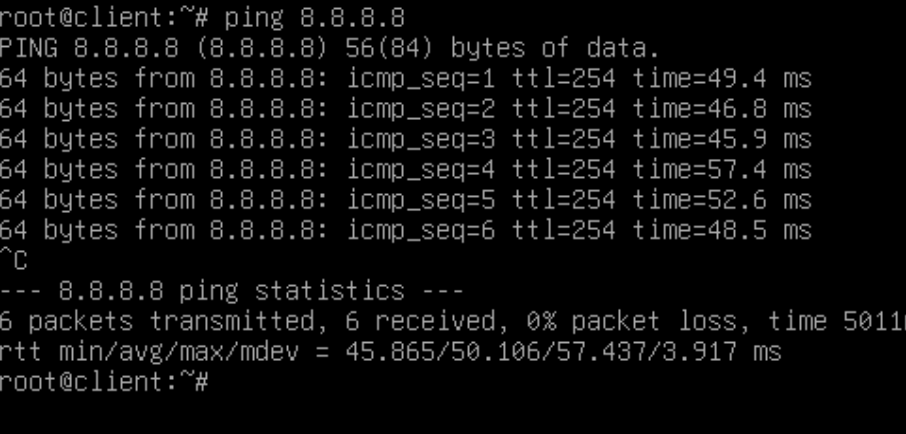

#   Практическая работа № 15

##  Установка NAT

### Задание

Ход работы сопровождайте скриншотами.

1. Установите 2 виртуальные машины Debian, на них настройте два сетевых интерфейса (1 -  NAT c выходом в интернет, 2 - internal network), на второй (internal network). 

2. Проверьте подключение к сети на обоих устройствах.

3. Разрешить передачу пакетов между сетевыми интерфейсами:

4. Настроить NAT:

5. Проверить подключение к сети internet на втором устройстве.

6. Опционально: настройте DNS на втором устройстве.