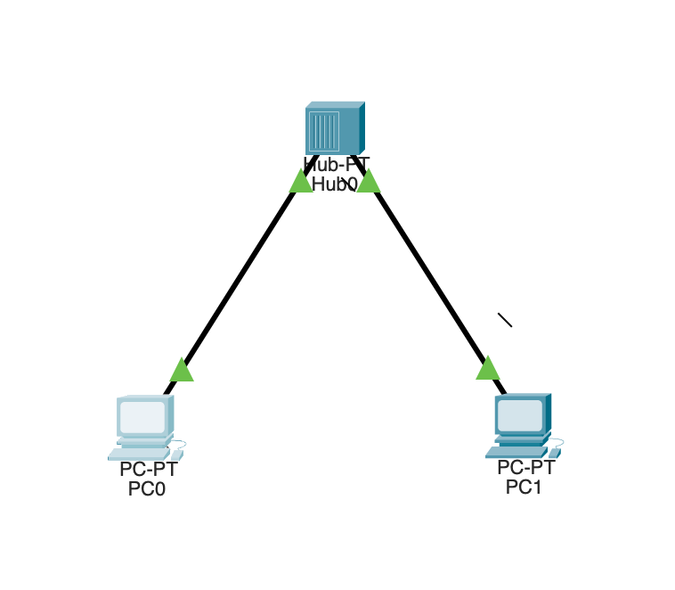
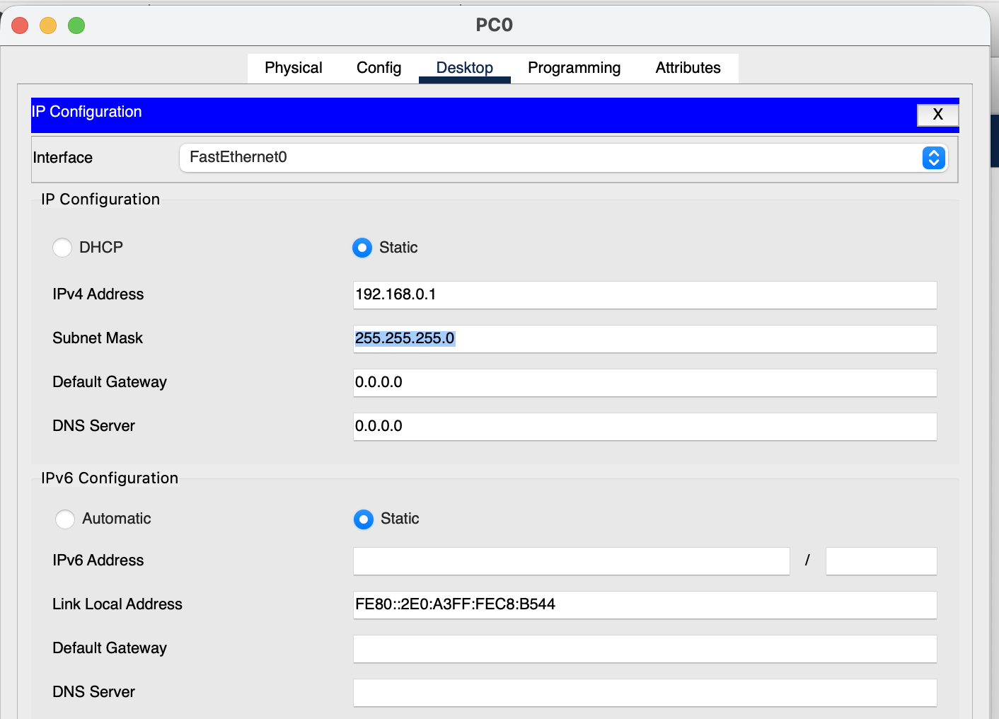
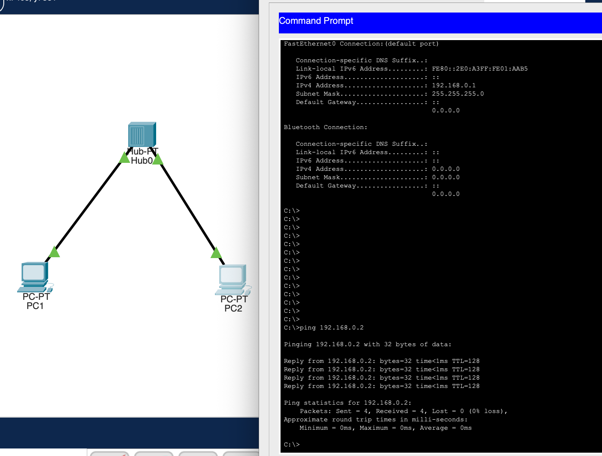

#   Практическая работа № 1

##  Объединение двух компьютеров в сеть с помощью хаба.

 
<b> Хаб </b> - сетевое устройство, которое предназначено для объединения нескольких Ethernet устройств в сеть. Хаб распространяет входящие сигналы на все поключенные устройства.

### Задание

1. С помощью хаба соединить два компьютера. Присвоить им IP-адреса согласно схеме.   

2. Задать компьютерам ipv4 адреса согласно схеме

3. Проверить подключение (отправить ICMP запрос с компьютера PC-1 к PC-2)

