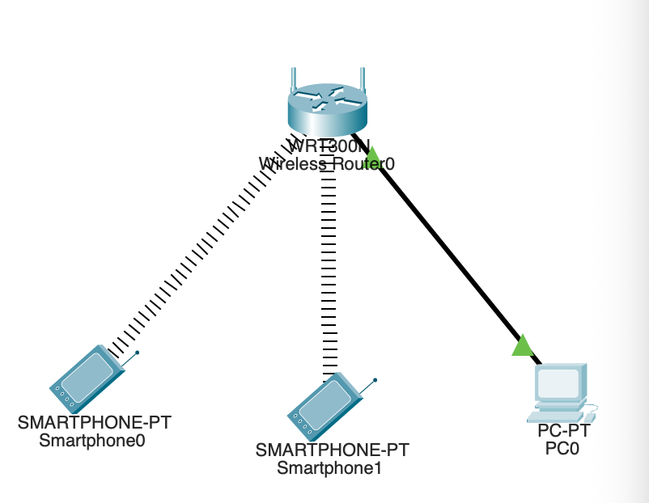
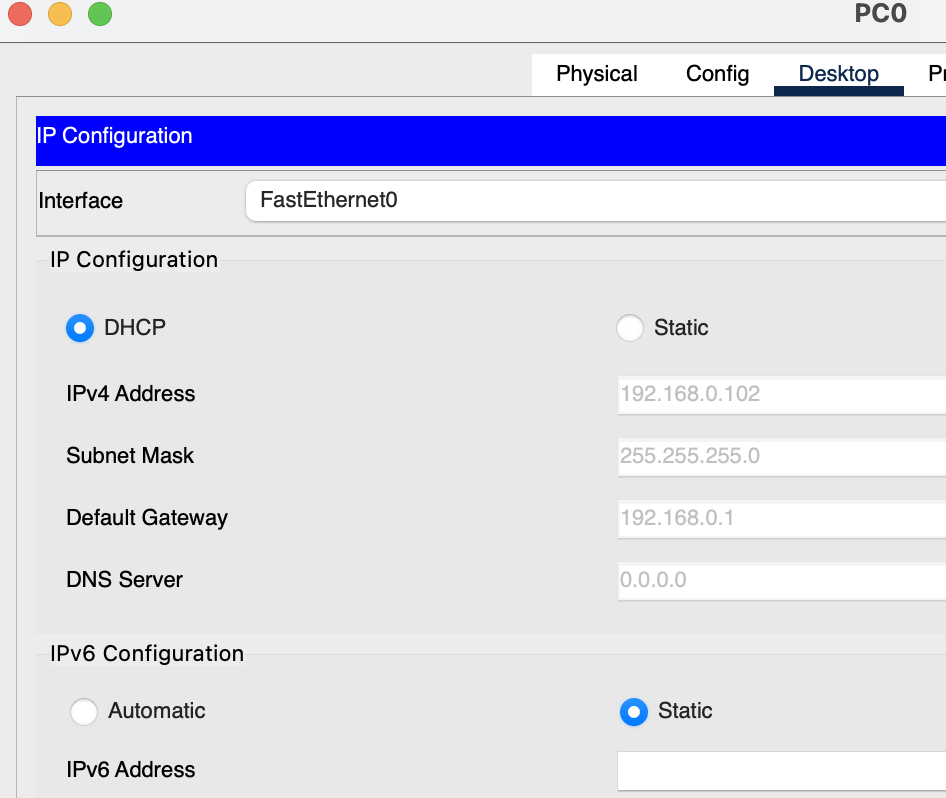
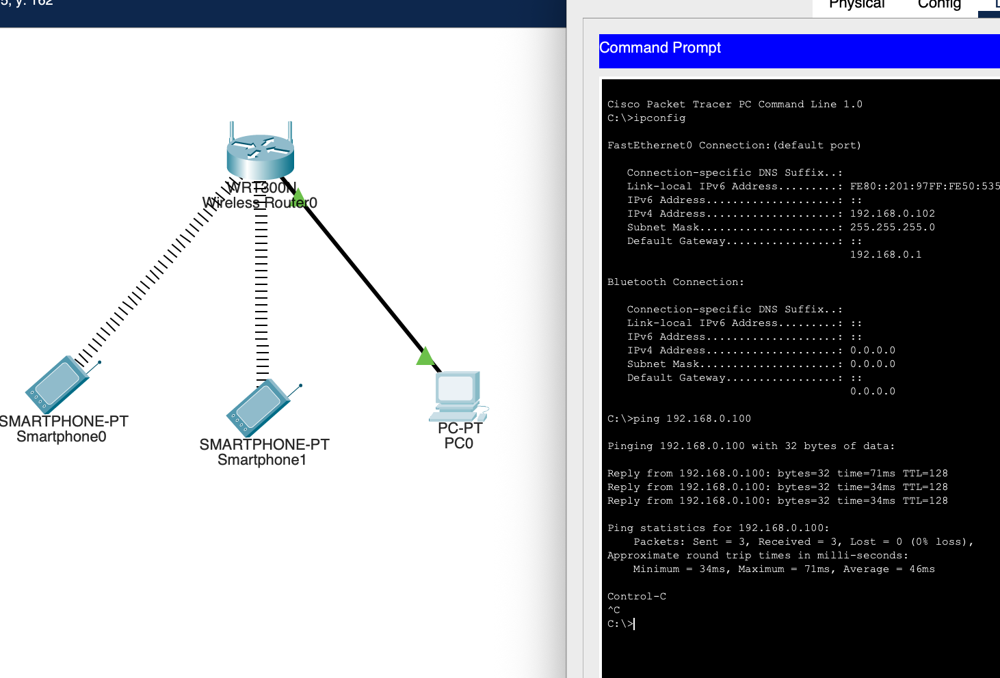

#   Практическая работа № 2

##  Настройка беспроводной сети. Протокол DHCP.

### Задание

1. С помощью беспроводного роутера объединить несколько устройств в сеть согласно схеме ( с помощью беспроводного и проводного подключения)

2. PC назначить адрес с помощью DHCP

3. Проверить подключение (отправить ICMP запрос с компьютера PC на беспроводное устройство)

