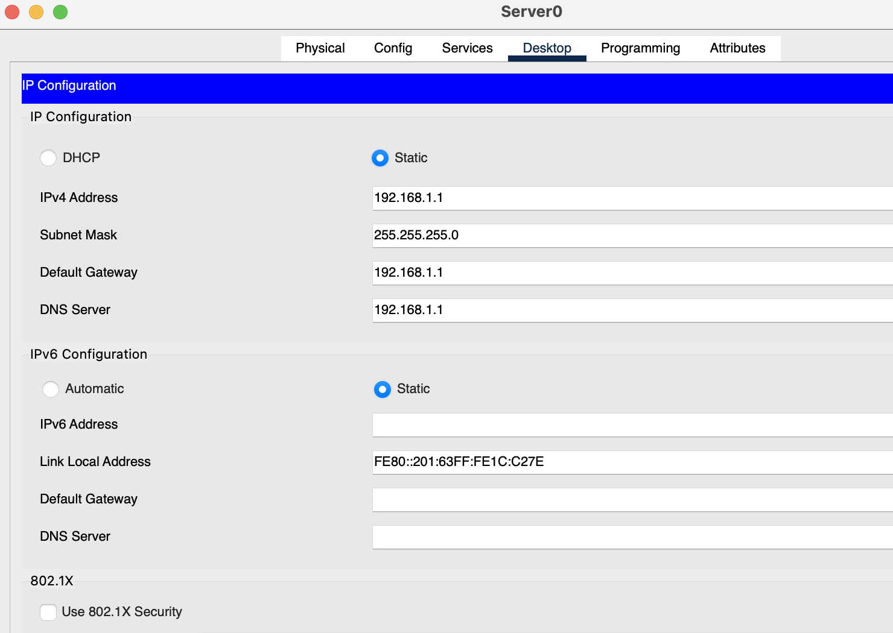
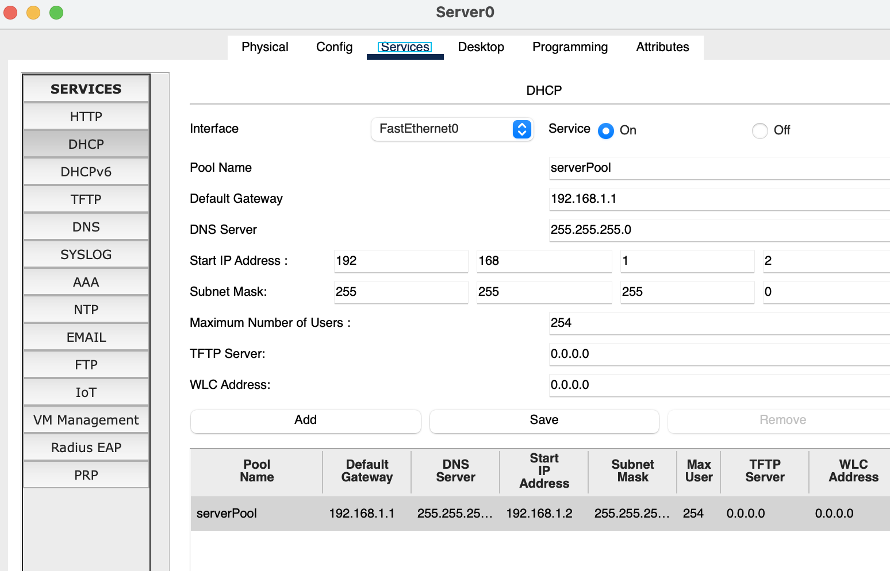
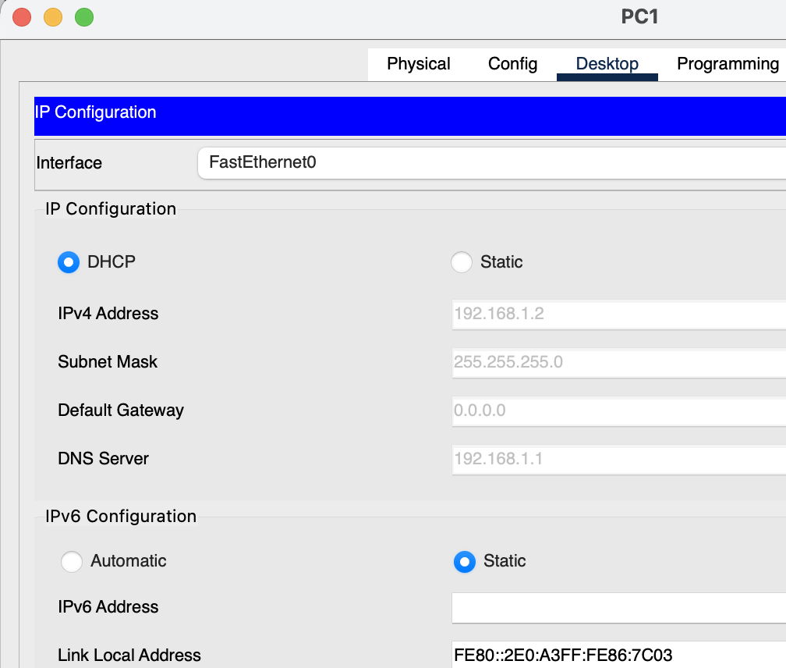
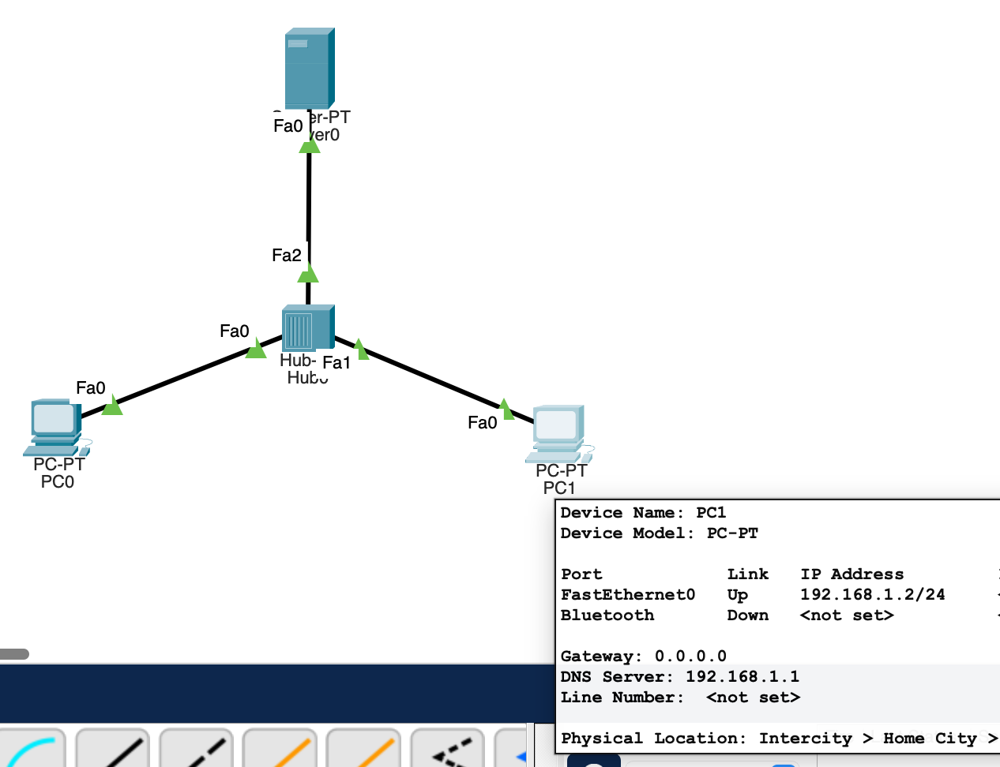
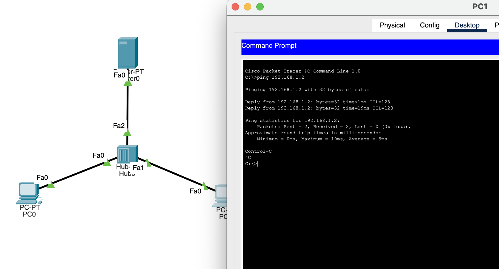

#   Практическая работа № 3

##  Протокол DHCP. Настройка сервера.

### Задание

1. С помощью хаба объединить компьютеры в сеть согласно схеме (с помощью проводного подключения).

2. На сервере задать статический адрес, например: 192.168.1.1 / 24

3. Настроить DHCP сервер. 

4. На устройстве задать тип подключения - DHCP

5. Получить адрес на устройстве.

6. Выполнить ICMP запрос с одного компьютера на другой.

