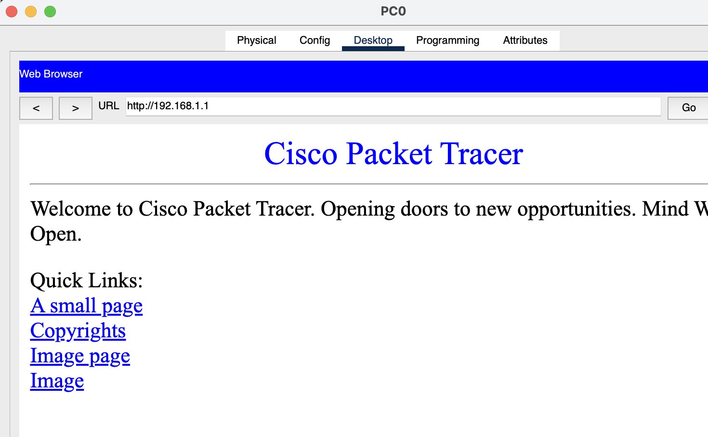

#   Практическая работа № 4

##  Packet Tracer: HTTP протокол

### Задание

1. Реализовать схему сети из практической № 3

2. Включить WEB-сервер (протокол HTTP)

3. На одном из компьютеров открыть веб-браузер и отправить http запрос на веб-сервер.

