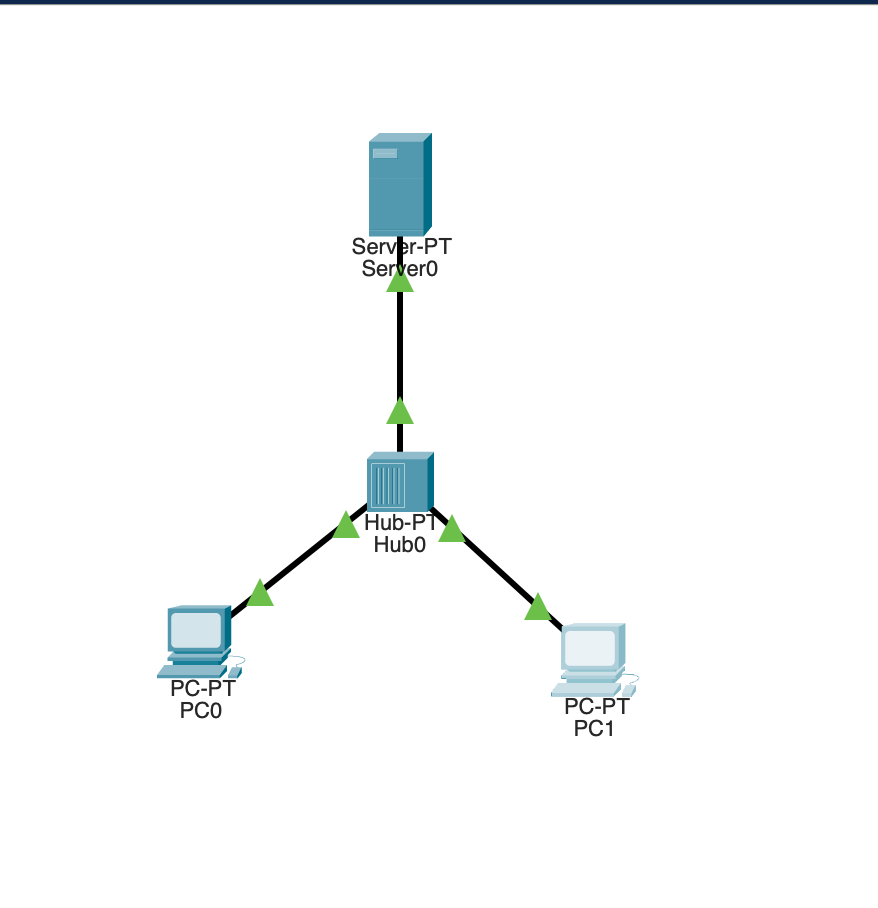
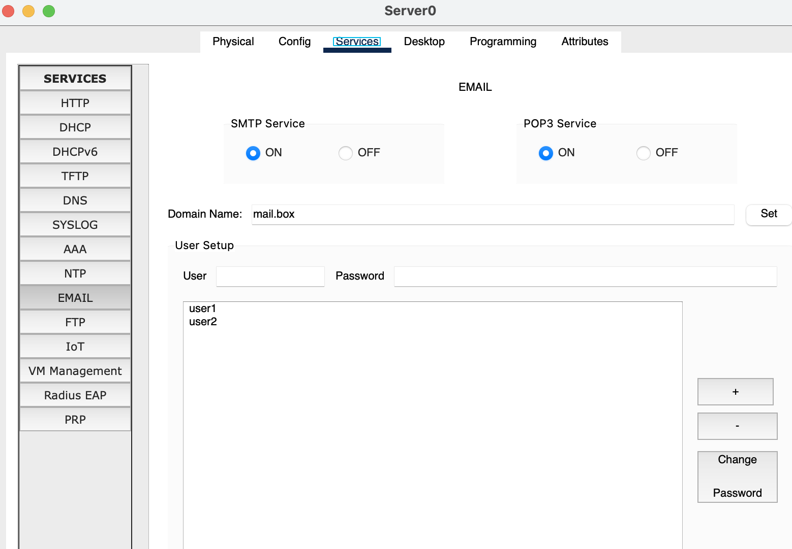
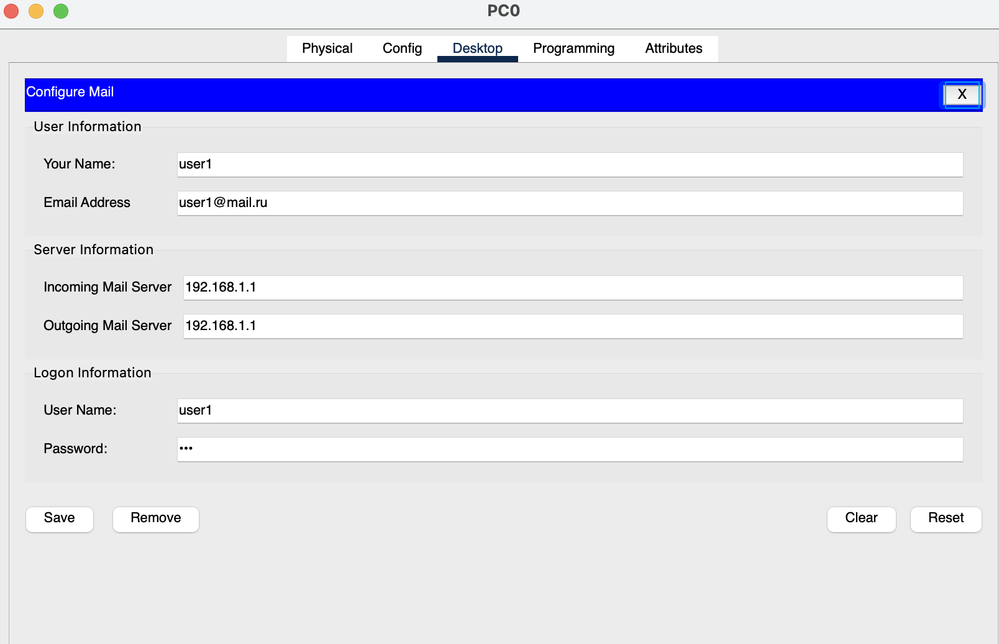
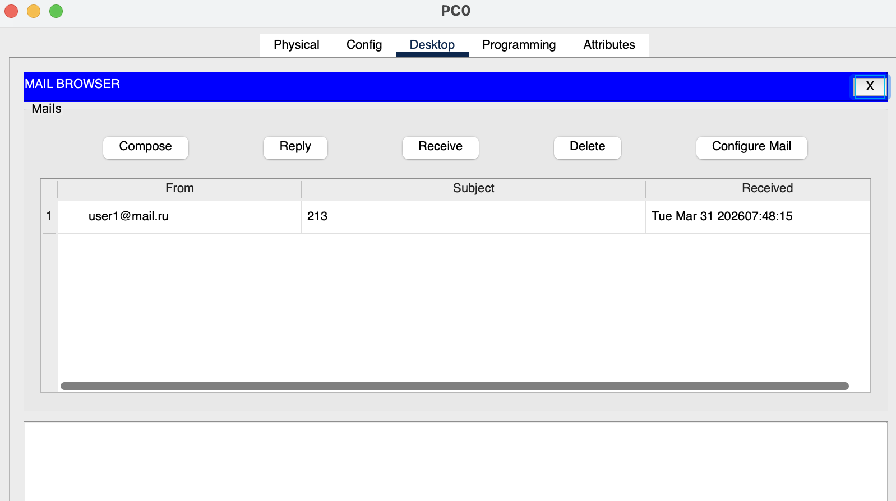

#   Практическая работа № 6

##  Packet Tracer: SMTP/POP3 сервер

### Задание

1. С помощью хаба объединить компьютеры в сеть согласно схеме (с помощью проводного подключения).

2. На сервере настроить почтовый сервер, создать 2 учетные записи.

3. На компьютерах настроить почтовые клиенты.

4. Отправить Email сообщение с одного компьютера на другой.

