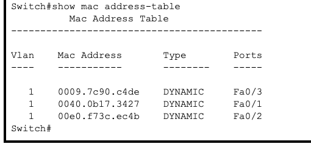
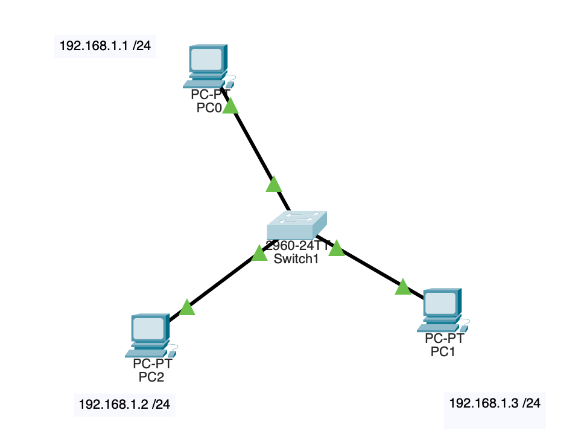

#   Практическая работа № 7

##  Изучение сетевого устройства - коммутатор.

 
<b> Коммутатор </b> - устройство, предназначенное для соединения нескольких узлов компьютерной сети в пределах одного или нескольких сегментов сети. В отличие от концентратора, который распространяет трафикот одного подключенного устройства ко всем остальным, коммутатор передаёт данные только непосредственно получателю, исключение составляет широковещательный трафик (на MAC-адрес FF:FF:FF:FF:FF:FF) всем узлам сети.

### Алгоритм обратного обучения

    Алгоритм обратного обучения (также известный как обучение MAC-адресов или самообучение) используется в сетевых устройствах типа коммутаторов (switch) для автоматического построения таблицы MAC-адресов.  
    Цель этого алгоритма — оптимизировать доставку кадров данных, минимизируя ненужную рассылку по всей сети.

#### Как работает алгоритм обратного обучения? ####

Шаги:
1. Первоначальная инициализация:  
    Изначально таблица MAC-адресов пуста. Все входящие кадры транслируются на все выходящие порты, кроме порта, на который пришел кадр (это называется широковещательным трафиком).
2. Получение кадра:  
    Когда коммутатор принимает кадр, он проверяет таблицу MAC-адресов, чтобы определить соответствующий выходной порт назначения.
3. Проверка наличия записи:  
    Если источник кадра (MAC-адрес отправителя) отсутствует в таблице, коммутатор добавляет новую запись в таблицу, связывая этот MAC-адрес с портом, на который пришёл кадр. Если запись уже существует, она обновляется (если истекло её время жизни).
4. Отправление кадра:  
    Если целевой MAC-адрес найден в таблице, кадр отправляется исключительно на указанный порт.
    сли целевого MAC-адреса нет в таблице, кадр снова рассылается широковещательно на все порты (кроме порта, откуда пришел кадр).
5. Время жизни записей:  
    Каждая запись в таблице имеет срок годности ("timeout"). По истечении указанного периода запись автоматически удаляется, если нет активности от соответствующего устройства. Это помогает поддерживать точность таблицы и освобождать память.
5. Удаление устаревших записей:  
    Периодически старые неиспользуемые записи удаляются, чтобы освободить пространство и предотвратить использование неправильных маршрутов.

Пример работы алгоритма  
Допустим, мы имеем простую сеть с тремя компьютерами A, B и C, подключенными к одному коммутатору:

Порт	| Устройство
--------| ------------
P1	    | Компьютер A
P2	    | Компьютер B
P3	    | Компьютер C

Сначала таблица MAC-адресов пуста. Рассмотрим последовательность шагов:

1. Компьютер A посылает кадр компьютеру B.  
2. Так как таблицы пустой, коммутатор транслирует кадр на все порты (широковещательная передача).  
3. Таблица обновляется записью: {MAC(A): P1}  
4. Компьютер B отвечает компьютеру A.  
5. Опять же, поскольку записи о компьютере B ещё нет, кадр опять широковещательный.  
6. Добавляем в таблицу: {MAC(B): P2}  
 
Теперь следующий кадр от компьютера A к компьютеру B направляется только на порт P2, так как соответствующая запись уже имеется в таблице.  
Со временем, если компьютер C пошлет первый кадр, его MAC также будет занесен в таблицу аналогично предыдущему примеру.  

### Таблица коммутации устройств Cisco

    Для того чтобы просмотреть таблицу коммутации на устройстве Cisco необходимо зайти в консоль устройства и выполнить команду:

    show mac address-table

    Для того чтобы очистить таблицу коммутации необходимо выполнить команду:

    clear mac address-table

### Таблица коммутации

### Схема сети 

### Задание

1. С помощью коммутатора соединить три компьютера. Присвоить им IP-адреса согласно схеме.   
2. В зайти в командную строку устройства и вывести на экран таблицу маршрутизации.
3. В режиме симуляции последовательно отправить ICMP запросы от узлов 1 - 3, 2 - 3, 2 - 1.
4. Зафиксировать маршруты ICMP пакетов и изменения в таблице коммутации устройства.
5. Добавить в отчет скриншоты выполненных команд и выводы о работе устройства.

