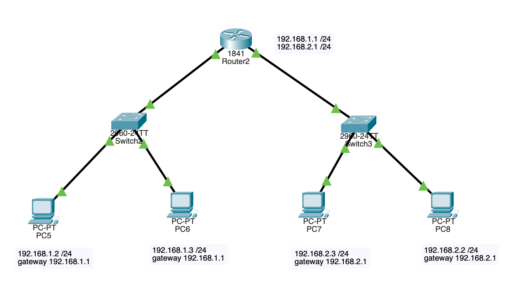

#   Практическая работа № 8

##  Объединение сегментов сети с помощью маршрутизатора

Цель работы: изучить работу сетевого устройства - маршрутизатор.  
Реализовать сетевую конфигурацию согласно схеме.

На маршрутизаторе настроить два сетевых интерфейса которые должны "объединить" подсети между собой.
С комьютера PC-0 выполнить ICMP запрос и трасcировку маршрута (tracert)  до компьютера PC-3.
В отчет добавить схему сети, ICMP запрос и трасcировку.

