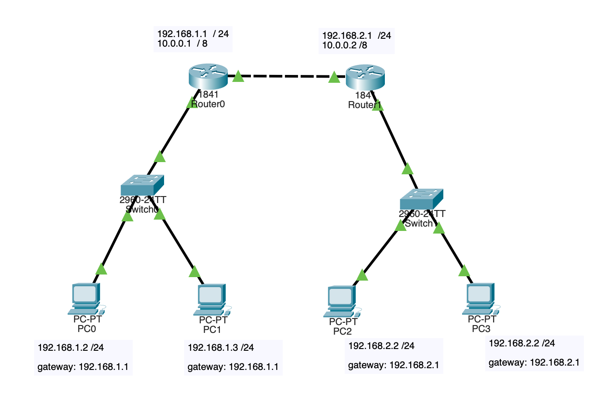

#   Практическая работа № 9

##  Объединение сегментов сети с помощью двух маршрутизаторов

Цель работы: объединение сегментов сетей с помощью двух маршрутизаторов.  
Реализовать сетевую конфигурацию согласно схеме.

На маршрутизаторах настроить маршрут ( роутинг ) из одной сети в другую. 
С комьютера PC-0 выполнить ICMP запрос и трасcировку маршрута (tracert)  до компьютера PC-3.

В отчет добавить схему сети, ICMP запрос и трасcировку.

